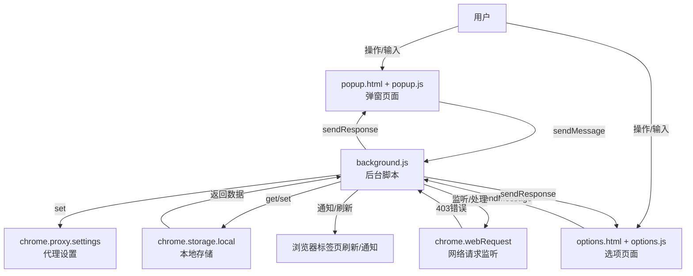

# AutoProxy 智能代理切换器

AutoProxy 是一款 Chrome 浏览器扩展，能够自动检测网页访问中的 403 错误，并根据用户配置的代理服务器自动切换代理，提升访问体验。支持自定义代理规则、域名管理、批量导入导出等功能。

---

## 主要功能

- **自动检测 403 并切换代理**：访问网页遇到 403 错误时，自动将该域名加入代理列表并通过代理重新请求。
- **自定义代理服务器**：支持设置代理服务器地址和端口。
- **代理域名管理**：可手动添加、移除、批量导入导出、清空被代理的域名。
- **一键刷新页面**：代理设置变更后可一键刷新当前页面，立即生效。
- **高级设置**：支持自定义代理测试域名、端点和超时时间。
- **状态指示与通知**：弹窗内显示代理状态，自动推送代理变更通知。
- **数据持久化**：所有设置和域名列表均本地存储，重启浏览器后自动恢复。

---

## 安装方法

1. 克隆或下载本项目到本地：
```bash
git clone https://github.com/0671/AutoProxy.git
```
2. 打开 Chrome，进入 `chrome://extensions/`。
3. 开启"开发者模式"，点击"加载已解压的扩展程序"，选择 `addon` 文件夹。

---

## 使用说明

### 快速上手

- 点击浏览器右上角插件图标，弹出主界面。
- 在"代理设置"中填写代理服务器地址和端口，点击"保存代理设置"。
- 访问网页时遇到 403 错误，插件会自动将该域名加入代理列表并重新加载页面。
- "当前被代理的域名"列表中可查看和移除已自动/手动添加的域名。

### 选项页面功能

点击弹窗中的"更多选项"按钮，进入选项页面，可进行：

- **代理服务器设置**：与弹窗一致。
- **代理域名管理**：
  - 手动添加域名到代理列表
  - 移除单个域名
  - 清空所有域名
  - 导入/导出域名列表（JSON 格式）
- **高级设置**：
  - 自定义代理测试域名、端点和超时时间
- **使用指南与操作提示**

---

## 架构与数据流



- **所有数据操作**（如代理配置、域名列表）均通过后台脚本统一管理和存储。
- **弹窗和选项页面**通过消息机制与后台通信，获取和更新数据。
- **后台自动监听**网络请求，遇到 403 错误自动添加域名并更新代理规则。
- **代理规则变更**后自动刷新相关页面并通知用户。

---

## 目录结构

```
addon                    # 插件文件夹
    img/icons/           # 插件图标资源
    background.js        # 后台脚本，核心逻辑
    manifest.json        # 插件配置清单
    options.html         # 选项页面（高级设置与域名管理）
    options.js           # 选项页面脚本
    options.css          # 选项页面样式
    popup.html           # 弹窗页面（快速设置与状态）
    popup.js             # 弹窗页面脚本
    popup.css            # 弹窗页面样式
    styles.css           # 通用样式
README.md                # 项目说明文档
```

---

## 常见问题

- **代理无效？**  
  请确认代理服务器地址和端口填写正确，且代理服务已启动。

- **403 域名未自动加入？**  
  请确保已授予插件足够的权限，并刷新页面重试。

- **设置未生效？**  
  修改代理配置或域名后，请尝试刷新当前页面。

---

## 致谢

感谢 Cursor, Claude 3.7 的支持。

---

如有建议或问题，欢迎提交 Issue 或 PR！ 